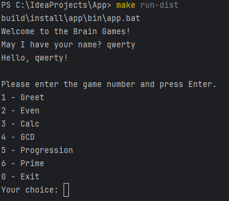
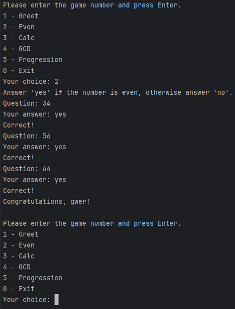
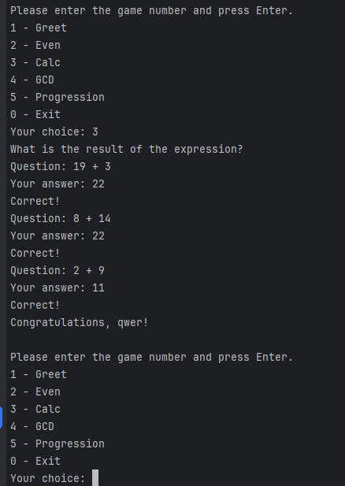
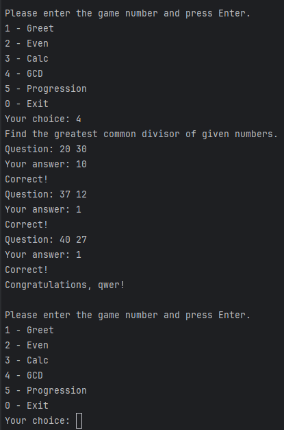
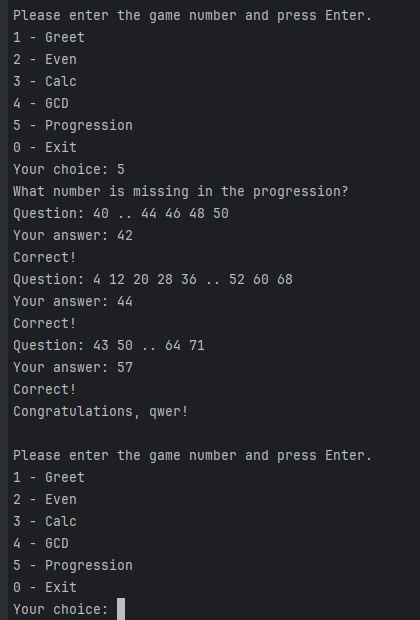
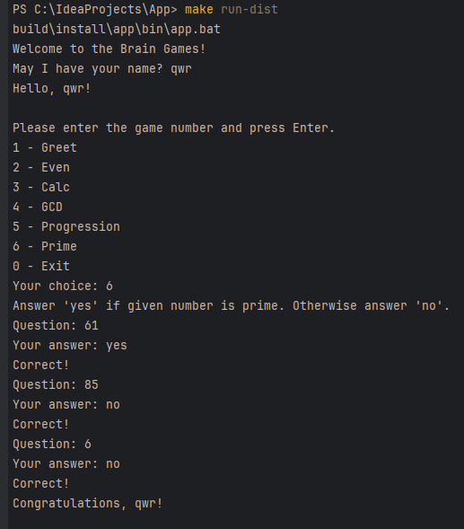

# Brain Games

Набор консольных игр для тренировки мозга.  
Проект реализован на **Java** с использованием **Gradle**, **Spotless** (форматирование по `google-java-format`) и *
*GitHub Actions** для автоматической проверки сборки.

## Игры

| Номер | Название    | Описание                                                                     |
|-------|-------------|------------------------------------------------------------------------------|
| 1     | Greet       | Приветствие – запрашивает имя и выводит персонализированное сообщение.       |
| 2     | Even        | Проверка на чётность – нужно ответить `yes`/`no` для случайного числа.       |
| 3     | Calc        | Калькулятор – вычислить результат арифметического выражения (`+`, `-`, `*`). |
| 4     | GCD         | Наибольший общий делитель – найти НОД двух чисел.                            |
| 5     | Progression | Арифметическая прогрессия – найти пропущенное число.                         |
| 6     | Prime       | Проверка числа на простоту – ответить `yes`/`no`.                            |

## Демонстрация работы

### 1 - Greet


### 2 - Even


### 3 - Calc


### 4 - GCD


### 5 - Progression


### 6 - Prime


## Архитектура

- `Engine.java` – общий движок для всех игр (приветствие, цикл из 3 раундов, проверка ответов).
- `Question.java` – класс-носитель пары «вопрос → правильный ответ».
- Каждая игра реализована в отдельном классе пакета `hexlet.code.games` со статическими методами `getDescription()` и
  `generateQuestion()`.
- Новые игры легко добавляются через расширение меню в `App.java`.

## Форматирование кода

Для автоматического форматирования используется **Spotless** с правилами `google-java-format` (версия AOSP, 4 пробела).

```bash
# Проверить нарушения стиля
./gradlew spotlessCheck

# Исправить все нарушения автоматически
./gradlew spotlessApply